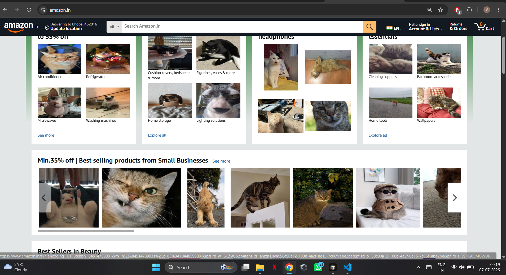
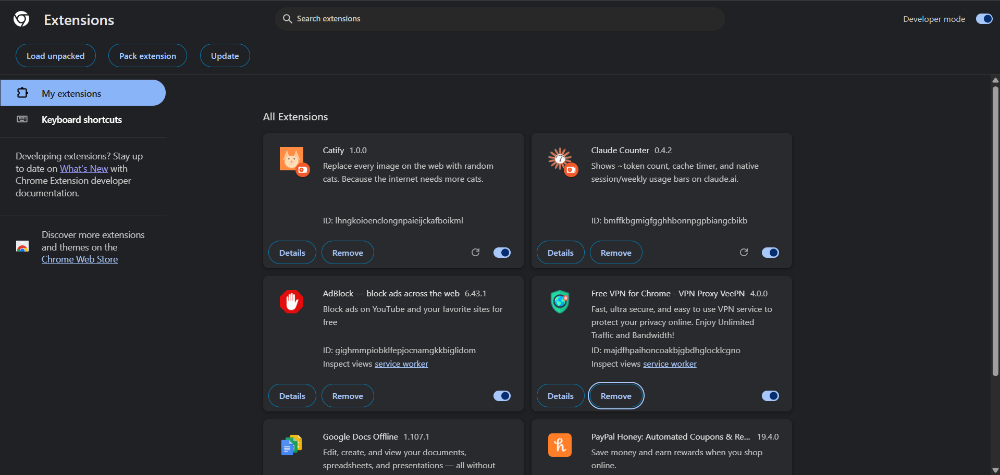
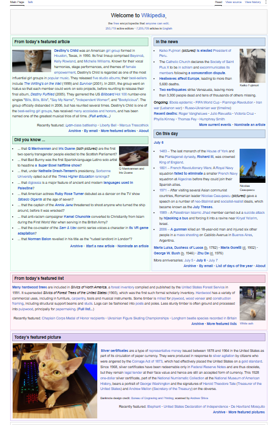
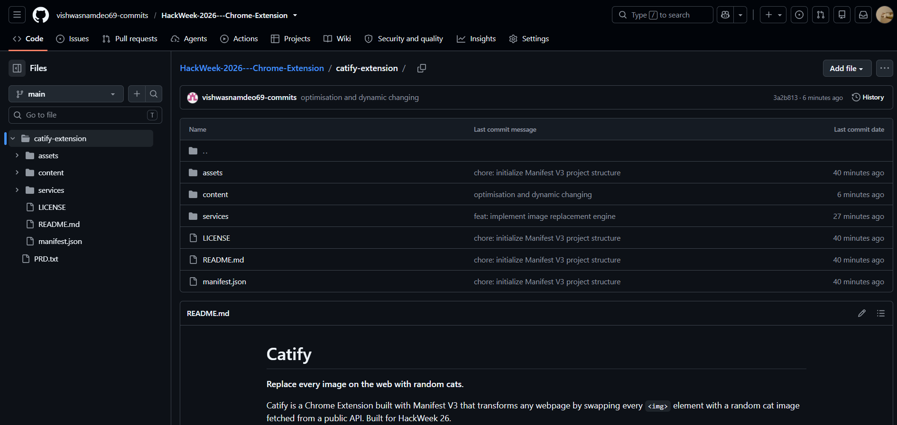

# 🐱 Catify

> **Transform every webpage into a cat paradise.**

Catify is a **Google Chrome Extension** built using **Manifest V3** that automatically replaces every image on a webpage with a random cat image fetched from a public API.

Designed as part of **HackWeek 2026**, the project demonstrates browser extension development, DOM manipulation, MutationObserver, and compatibility with modern dynamic websites.

---

## 📸 Demo

### Catify in Action

## 📸 Amazon Demo



## 📸 Extension Installed



## 📸 Wikipedia Demo



## 📸 Github repo Demo




---

## ✨ Features

- ✅ Built with **Manifest V3**
- ✅ Automatically replaces all webpage images with random cats
- ✅ Works on static websites
- ✅ Supports dynamically loaded images
- ✅ MutationObserver for modern SPA compatibility
- ✅ Handles lazy-loaded content
- ✅ Lightweight architecture
- ✅ No backend required
- ✅ Developer Mode installation

---

## 🏗 Architecture

```

Chrome Browser
│
▼
Manifest V3
│
▼
Content Script
│
├── Detect Existing Images
│
├── MutationObserver
│
├── Detect Dynamic Images
│
▼
Cat Service
│
▼
Random Cat API
│
▼
Replace Image Source

```

---

## 📂 Project Structure

```

.
├── assets/
│ ├── icon16.png
│ ├── icon48.png
│ └── icon128.png
│
├── content/
│ └── content.js
│
├── services/
│ └── catService.js
│
├── docs/
│ └── screenshots/
│
├── manifest.json
├── README.md
└── LICENSE

````

---

## ⚙ Installation

### Clone Repository

```bash
git clone https://github.com/YOUR_USERNAME/catify-chrome-extension.git
```

Open Chrome

Go to

```
chrome://extensions
```

Enable

```
Developer Mode
```

Click

```
Load unpacked
```

Select the project folder.

Done!

---

## 🚀 How It Works

### 1. Chrome Loads Extension

Chrome reads

```
manifest.json
```

and injects the content script into every webpage.

---

### 2. Existing Images

The content script scans

```javascript
document.querySelectorAll("img")
```

Every detected image is replaced with a random cat image.

---

### 3. Dynamic Images

Modern websites continuously add new images.

Catify uses

```
MutationObserver
```

to monitor DOM changes and automatically replace newly inserted images.

---

### 4. Lazy Loading Support

Some websites update images after they are inserted.

Catify also observes changes to

* `src`
* `srcset`
* `sizes`

allowing compatibility with lazy-loaded and dynamically updated images.

---

## 🛠 Tech Stack

| Technology            | Purpose                       |
| --------------------- | ----------------------------- |
| JavaScript (ES6)      | Core extension logic          |
| Manifest V3           | Chrome Extension architecture |
| DOM API               | Image detection               |
| MutationObserver      | Dynamic content detection     |
| Cataas API            | Random cat images             |
| Chrome Developer Mode | Extension testing             |

---

## 📸 Screenshots

### Extension Installed


---

### Wikipedia


---

### Amazon


---

### YouTube


---

## 💡 Technical Challenges

During development several modern browser behaviors had to be addressed.

### Dynamic Websites

Many websites continuously insert new images while scrolling.

Solved using

* MutationObserver
* Child node detection

---

### Lazy Loading

Some websites update image sources after insertion.

Solved by observing

* src
* srcset
* sizes

attribute changes.

---

### Preventing Infinite Loops

Replacing an image also changes its attributes.

To avoid recursive processing, Catify uses internal processing flags and processed markers.

---

### Responsive Images

Modern websites often use `<picture>` elements.

The extension clears responsive image attributes where required before replacing image sources.

---

## 🔮 Future Improvements

* Popup UI
* Enable / Disable toggle
* Website whitelist
* Dog mode 🐶
* Custom image categories
* Chrome Web Store publishing

---

## 🎥 Demo Video

> Demo video will be available here after submission.

```
<Add YouTube or Google Drive Link>
```

---

## 👨‍💻 Author

**Vishwas Namdeo**

B.Tech Computer Science (CSIT)

HackWeek 2026 Submission

GitHub:

```
https://github.com/vishwasnamdeo69-commits
```

---

## 📜 License

This project is licensed under the MIT License.

---

## ⭐ Acknowledgements

* Google Chrome Extension Documentation
* Manifest V3
* Cataas API
* HackWeek 2026

---

> **Because every webpage deserves more cats. 🐱**

``